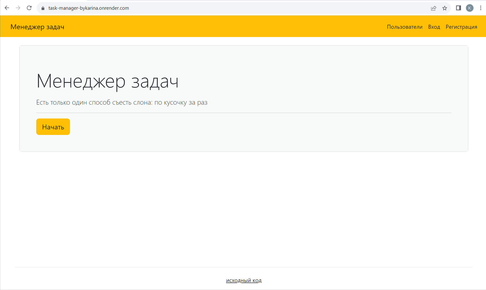

# Study project No. 4 'Task Manager'

[](https://github.com/KarinaAbd/python-project-52/actions)
[](https://codeclimate.com/github/KarinaAbd/python-project-52/maintainability)
[](https://codeclimate.com/github/KarinaAbd/python-project-52/test_coverage)

try [Task Manager](https://task-manager-bykarina.onrender.com/) yourself
***



This repository was created as part of [a Hexlet study project](https://ru.hexlet.io/programs/python/projects/52). "Task Manager" is a a web application that allows you to set tasks, assign executors and change their statuses. Registration and authentication are required to work with the system.

## How to install for develop

Make a fork and clone the repository locally.
```bash
cd python-project-52/
# install poetry
make install
```
Create `.env` file in the root folder and add following variables:
```python
DATABASE_URL = # For develop can be used sqlite3, for production PostgreSQL
SECRET_KEY = # Necessary for Django
LANGUAGE = # By default the app will use ru-ru locale, you can set also en-us
DEBUG = True # If not set, value will be False
```
And run it local:
```bash
make build
make start
```
